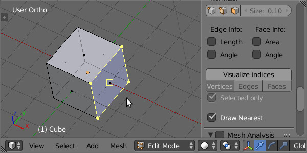
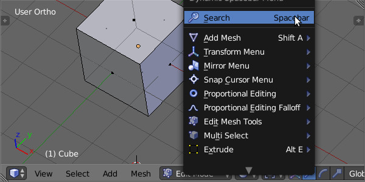
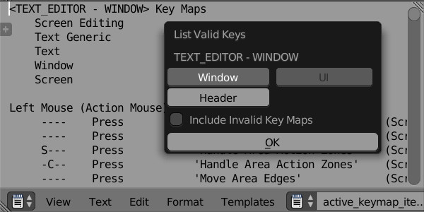

# Blender Addon 'CTools'

下記の物をまとめたアドオン

## [Edit Mesh Draw Nearest](https://github.com/chromoly/blender-EditMeshDrawNearest 'Screencast Key Status Tool')
マウスクリックで次に選択するであろう要素を強調表示する。  

## [Lock Coordinates](https://github.com/chromoly/blender_lock_coords 'Lock Coordinatesl')  
頂点の移動、選択を抑制する。  

## [Lock 3D Cursor](https://github.com/chromoly/lock_cursor3d 'Lock 3D Cursor')  
マウスクリックでの3Dカーソル移動を禁止する。以前コミットされ、その後消されたものをアドオンで再現。  

## [Mouse Gesture](https://github.com/chromoly/blender_mouse_gesture 'Mouse Gesture')  
マウスジェスチャー。  

## [Overwrite Builtin Images](https://github.com/chromoly/blender-OverwriteBuiltinImages 'Overwrite Builtin Images')
スプラッシュとアイコン画像を変更するアドオン(Linux専用)。  
同梱のoverwrite_builtin_images.pyはバイナリに埋め込まれた画像を書き換えるスクリプト(Windows/Linux)。  

## [QuadView Move](https://github.com/chromoly/quadview_move 'QuadView Move')
マウスドラッグでQuadView境界を移動する。  

## [Region Ruler](https://github.com/chromoly/regionruler 'Region Ruler')
3DView、ImageEditor、NodeEditorにRulerを表示する。
)

## [Screencast Keys Mod](https://github.com/chromoly/blender-ScreencastKeysMod 'Screencast Keys Mod')
[Screencast Key Status Tool](http://wiki.blender.org/index.php/Extensions:2.6/Py/Scripts/3D_interaction/Screencast_Key_Status_Tool "Screencast Key Status Tool")をオペレータ実行中のイベントも取得出来るように勝手に改造したもの。

## [Update Tag](https://github.com/chromoly/blender_update_tag 'Update Tag')
マテリアルやテクスチャのドライバーの値が変更された際に3DViewを更新する。  

## List Valid Keys
現在アクティブなAreaとRegionで有効なショートカットの一覧を標準出力かTextへ出力する。

## Quick Boolean
四角形、円形等でメッシュを切り抜く。ObjctModeとEditModeで利用可。

## その他
### patch/ui_layout_box.patch
alignが真の状態のUILayoutでbox描画に不具合が起こる問題を修正するパッチ。  
適用前:  
  
適用後:  
